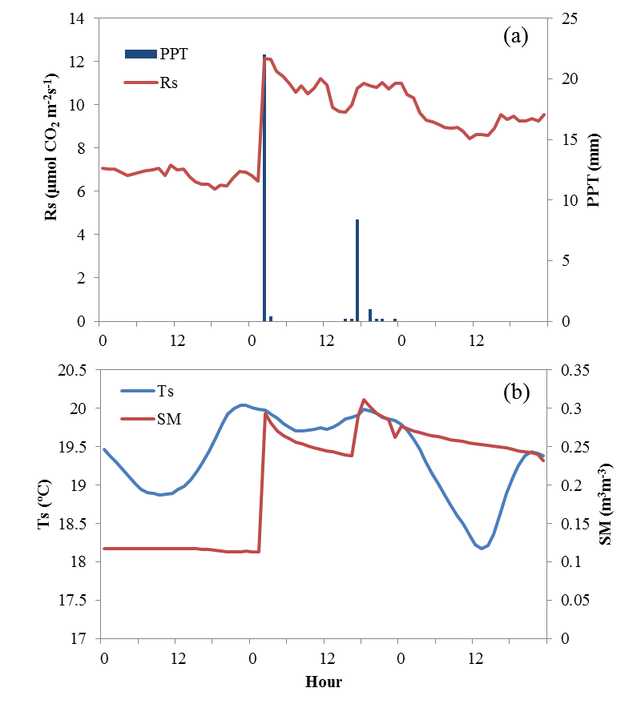
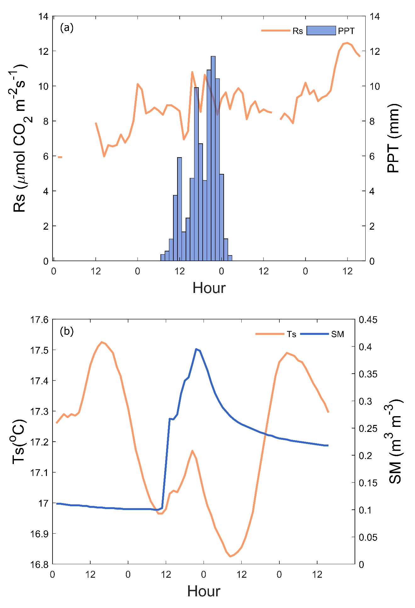
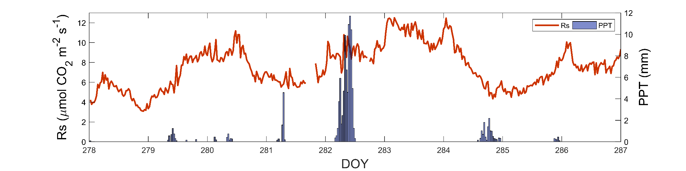
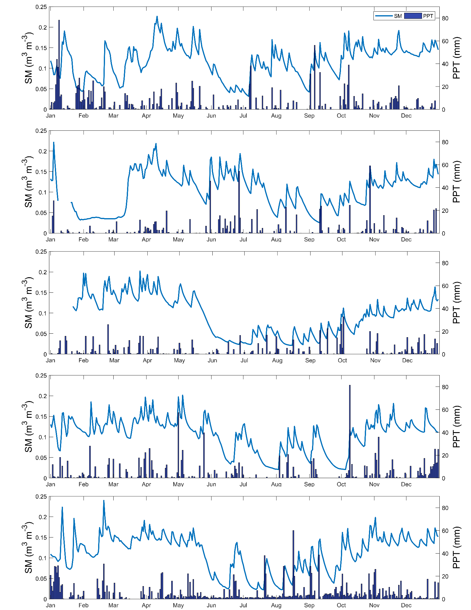

[comment]: <> (Need this to be included or else you get a Environment cslreferences undefined)
\newlength{\cslhangindent}
\setlength{\cslhangindent}{1.5em}
\newenvironment{cslreferences}%
  {\setlength{\parindent}{0pt}%
  \everypar{\setlength{\hangindent}{\cslhangindent}}\ignorespaces}%
  {\par}
  
```{r echo = FALSE, message = FALSE}
#surpresses any R warnings in the final document
knitr::opts_chunk$set(warning=FALSE, echo = FALSE)
```

```{r setup, include=FALSE}
#making images don't move positions
knitr::opts_chunk$set(echo = TRUE, fig.pos= "h")
```

```{r echo = FALSE, message = FALSE}
#load the libraries so we can use kable and %>% 
library(kableExtra)
library(magrittr)
library(dplyr)
library(R.matlab)
library(ggplot2)
library(gridExtra)
library(reshape2)
library(cowplot)
library(grid)
library(tinytex)
```

1. Introduction
===============

Forests account for 3.7 billion hectares of the planet’s surface area and cover around 31% of the world’s land surface. They primarily provide vital services at both global regional scales; including the regulation of climate, hydrological cycles, air and water quality, and biogeochemical cycles [@Apps.1996; @Matsumoto.2008]. In addition to these ecosystem services, they provide significant economic resources to various industries related to lumber, pulp, and construction.
\newline
\newline
Soil respiration (Rs) is the release of CO~2~ through heterotrophic and autotrophic activity and accounts for 30 – 80% of net CO~2~ release within forests [@Davidson.2006; @YiqiLuo.2006]. Within the carbon cycle, 10% of the atmospheric CO~2~ is passed through the soil each year primarily through organic matter decay [@Raich.1995]. Variability of Rs is influenced by diurnal, seasonal, and annual patterns along with multiple factors such as soil moisture and temperature. When compared to the atmosphere and biotic sinks the soil carbon sink is 3.2 and 4 times larger, respectively [@Lorenz.2010; @Edenhofer.2014]. On account of the storage differences, a small change in Rs due to improper management techniques can result in a large release of CO~2~ into the atmosphere.
\newline
\newline
Quantifying Rs can indicate various physiological processes, as well as the ability of soil to support life including plants, animals, and microorganisms [@Liu.2016]. By modeling, mapping, and monitoring flux movement, forest management techniques can be utilized to decrease the amount of CO~2~ released into the atmosphere. Changes in Rs rates can also indicate external processes, such as disturbance (for example cultivation) which typically increases Rs [@Schlesinger.2000]. 
\newline
\newline
Rs models can be classified into two types: empirical and mechanistic. Empirical models typically use regressional analysis of Rs with temperature and moisture which is derived from observed data. Mechanistic models are created using environmental and biological factors that contribute to Rs. These models can be categorized into two parts: the CO~2~ production model; which considers factors that produce CO~2~, and the CO~2~ production-transport models; which considers CO~2~ production along with its transport to the soil surface.
\newline
\newline
The specific objectives of this study are to (1) gain a better understanding of the spatial and temporal dynamics of Rs, (2) determine how Rs responds to its main controlling variables (i.e. soil temperature and soil moisture), (3) help determine the impact of extreme weather events on Rs, (4) to compare several different models with varying complexity using a wide range of parameters, and (5) to determine which model produces the best fit and Rs estimation.

2. Materials and Methods
========================

This study was conducted in a 90 – year old managed deciduous (Carolinian species) forest (TPD) northwest of Long Point Provincial Park in Southern Ontario, Canada (42.64^o^N, 80.56^o^W). The forest is naturally regenerated on sandy terrain and abandoned agricultural land, and has been managed (thinned in the past). Predominant tree species include: white oak (\textit{Quercus alba}), sugar and red maple (\textit{Acer saccharum, A. rubrum}), american beech (\textit{Facus grandifolia}), black and red oak (\textit{Q. veluntia, Q. rubra}), and white ash (\textit{Fraxinus americana}). Average tree height is 25.7 m with a diameter at breast height of 22.3 cm. The leaf area index (LAI) of the site was measured by a canopy analyzer (model LAI-2000, LI-COR, Lincoln, Nebraska, USA) and TRAC (Tracing Radiation and Architecture of Canopy, developed by Dr. Jin M. Chen’s group at the University of Toronto). This site is part of the Turkey Point Flux Station (TPFS) and associated with Ameriflux and global Fluxnet Networks. Further site information is found in Table \ref{tab:site_description}.
\newline
\newline
The topography is undulating, with well – drained, mostly sandy soil (Brunisolic Gray Brown Luvisol) with low to moderate water holding capacity. The soil organic layer depth typically ranged from 2 to 6 cm. In September of 2014, soil cores and litter samples were taken and sent for nutrient analysis (A & L Canada Laboratories, Inc., London, Ontario). The samples were analyzed for total organic matter content, carbon, nitrogen, phosphorus, potassium, magnesium, calcium, and other additional soil characteristics. The soil nutrient content is outlined in Table \ref{tab:topography}. 30 – year climate normal, based on 1981 – 2010 Environment Canada weather data collected at Delhi, Ontario CDA weather station, indicate a mean annual temperature of 8.0^o^C and mean annual precipitation (PPT) of 136 mm (906.4 mm of which falls as rain and 129.5 cm as snow). 
\newline
\newline
Continuous Rs was recorded using an automated soil CO~2~ flux measurement system, taking half hourly measurements from July 2014 to November 2018 for the snow free growing season. Measurements are comprised of 3 main components: the gas analyzer (hosted in an analyzer control unit) (LI-8100A), long term measurement chambers (LI8100 – 104), and a multiplexer to allow for multiple chamber measurements (LI-8150) (LI-COR Lincoln, Nebraska, USA. Two measurement chambers were deployed from July to December 2014, and increased to five in April 2015. Each chamber extended approximately 15 m from the central analyzer control unit and multiplexer, measuring half – hourly Rs in sequence. Chambers are equipped with a soil temperature (Ts) and soil moisture (SM) probe (LI8150 – 203 and LI8150 – 205 respectively) at 5 cm depth installed outside of the collar.
\newline
\newline
The soil collars are comprised of thick – walled PVC pipe with an internal diameter of approximately 20 cm, a height of 11.5 cm, and a thickness of 1 cm. Each collar is inserted approximately 7 – 8 cm into the soil surface, with 3 cm remaining above. The measurement chamber is placed directly on the soil collar, remaining open when not taking active measurements. Throughout the growing season, any vegetation growth as removed from inside the collars to eliminate potential photosynthesis effects.
\newline
\newline
Measurements from the first chamber was removed from 2014 to 2017 due to a wasp nest causing increased CO~2~ reports. Data is processed using Soil Flux Pro (4.0.1) from LI-COR Biosciences, Inc. by analyzing the exponential flux and iteration obtained every 3 – 4 min within the 30 min measurement period. The exponential flux is the CO~2~ flux determined by the exponential fit which uses the dilution corrected CO~2~ (C) plotted against time in seconds (the difference between the start and stop time) (t) (Equation 1). The resulting plot is fit with a non-linear regression equation that solves for C~$\infty$~, t~0~, and $\alpha$ where C~o~ is the starting measured CO~2~ concentration. The CO~2~ flux based on the slope of the regression equation is reported as the exponential flux. 

$$ C(t) = C_\infty + (C_0 - C\infty)e^{-\alpha(t-t_0)} $$

Measurements that report a higher exponential iteration (greater than 10) was processed further by changing the start time affecting the overall t value until the exponential iteration is less than 10.
\newline
\newline
Linear and non-linear analyses are performed on daily measure of measured Rs data for gap filling. Three models are derived to determine the correlation between Rs and its environmental controls, outlined in Table \ref {tab:models}. The first is a simple, exponential regression between Rs and Ts (Rs Ts) by @Hoff.1899, the second is the annual temperature response model (Rs Q~10~). The third is the Q~10~ model modified with a logistic function [@Khomik.2010] to incorporate soil moisture effects (Rs SM). The models are evaluated using 70% of observed measurements for training and 30% of data for model testing. 
\newline
\newline
Each model was used to simulate daily, yearly, and seasonal (spring = March – May, summer = June – August, Autumn = September – November, Winter = December – February) and growing season (March – November) Rs emissions, and compared to ecosystem respiration (RE) data derived from eddy covariance measurements. The models are evaluated using coefficient of determination (R2), error sum of squares (SSE), standard deviation (STD), relative error (RE), slope and intercept of the testing function to Y = x, and yearly fit to observed Rs.
\newline
\newline
The daily Rs recorded by automated chamber measurements during the study period are shown in Figure \ref{fig:rstimeSeries}. The seasonal trend of Rs follow closely that of Ta and Ts, reaching maximum values in the summer months, then followed a declining trend throughout the rest of the year. An increase in Rs during and following precipitation events was observed. For example, on September 2nd, 2014 there was a 22.4 mm precipitation event which caused an increase of SM from 0.1 to 0.28 m^3^ m^-3^ and an 88% increase from 6.5 to 12.2 µmol CO~2~ m^-2^ s^-1^ (Figure \ref{fig:rainEvent2014}). 
\newline
\newline
Rs did not return of pre-rain event Rs until September 8th, 6 days after the rain event. On October 9th, 2017 there was a 11.7 mm precipitation event which caused an SM increase of 0.1 to 0.39 m3m-3 and an 78% in Rs from 5.97 to 10.63 µmol CO~2~ m^-2^ s^-1^ (Figure \ref{fig:rainEvent2017}) until October 29, 20 days after the rain event. Rs coverage at the site is 36.71%, 55.07%, 55.07%, 50.68%, and 55.62% from 2014 to 2018.

3. Results
==========

A comparison of modeled and observed daily mean Rs during the growing season for all years are shown in (Figure \ref{fig:rsEstTest}). The modeled vs observed regression analysis and the coefficient of determination of each model is shown in Table \ref {tab:modelTrain}. Model relative error is shown in (Figure \ref{fig:barOut}) and standard deviation with error sum of squares are shown in Table \ref {tab:rsStats}. In all years (with the exception of 2014 and 2016) the Rs SM model produced the highest correlation coefficient and the lowest SSE. The relative error between the Rs Ts and Rs Q~10~ is relatively similar with a standard deviation 
\newline
\newline
To better visualize the temporal trends in model fit, the daily relative error of each fitted models is plotted in a stacked bar plot over the study period (Figure \ref{fig:barOut}). There were clear seasonal trends for all of the models. In all of the years, the models produced a positive relative error values during the summer months (June, July, and August), representing an underestimation of Rs values. Towards April/May to the summer months and at the end of August towards the end of the measurement period, the models were produced negative relative error indicating an overestimation of Rs. There were large relative error values at the end of 2014 and at the beginning of 2016 to 2018 which could be the result of instrumentation problems resulting in a loss of Rs data, inhibiting the ability to produce a model that accurately predicts Rs during that season. Another possibility could be due to high temperatures in 2016 which is followed by a high precipitation event in 2017 and the re-addition of another chamber in 2018.
\newline
\newline
When daily relative error is plotted against a function of temperature, (Figure \ref{fig:tempRE}) Rs Ts and Rs Q~10~ is shown to have similar relative error values with all models resulting in positive relative errors during high temperatures and negative relative errors at low temperatures (with the exception of 2017 and 2018). In 2017, relative error was uniform at higher temperatures indicating better model prediction. In 2018, relative error was consistent throughout temperature ranges due to the addition of another chamber and increased training sample size.
\newline
\newline
Each model was used to simulate seasonal and growing seasonal Rs emissions which are summarized in Table \ref {tab:seasons}. Across the three models, spring had the lowest carbon emissions. The highest estimates were in the summer season, with emissions declining again the autumn and winter. No model estimated below 1200 m^-2^ s^-1^ in 2014, 2017 and 2018. 

4. Discussion and Conclusion
============================

The effect of temperature on Rs can be expressed using the Q~10~ model coefficients, R~10~ and Q~10~ (Table \ref {tab:modelTrain}. The basal respiration rate at 10^o^C (R~10~) is related to the volume of the soil column that is biologically active, i.e. the size and activity of microbial and root population [@Mo.2005].The Q~10~ value is the temperature sensitivity of Rs to warming (@Jia.2013). The Q~10~ values obtained at our site were found to range from 1.70 to 2.36 (Table \ref {tab:modelTrain}) and R~10~ values ranged from 2.84 to 4.73. This was found to be within range of literature – reported values [@Tang.2014; @Greco.1996; @Xu.2004] and followed distinct seasonal trends. 
\newline
\newline
Few studies have quantified the total contributions of Rs pulses following rain events to total Rs. @Lee.2002 reported an increase in Rs rates of 16 – 21% following rain events in a temperate deciduous forest in Japan. @Liu2.2016 conducted a meta – analysis on precipitation treatments across multiple biomes and found that precipitation events in temperate forests cause an increase in Rs of 17 – 30%. Furthermore, drought can also influence soil respiration. The study concluded that longer drought periods showed an increase in soil and heterotrophic respiration in accordance to the period of drought. This is shown in (\ref{fig:droughtEvent}) where after a long period of drought in September 2017 (a period of 19 days; Figure \ref {fig:smPPT}), a precipitation event caused a spike in Rs greater than those seen in early to mid – summer.
\newline
\newline
2014 models produced a poor yearly fit and coefficient of determination mainly because of 3 factors: the lack of data coverage from measurement later within the season, the removal of one chamber due to high CO~2~ measurement from a wasp nest, and the number of chambers (3 in 2014 compared to 5 in 2015). This resulted in dependent on time series data training to produce a worse fit. More complex models (Rs SM) produced a spike in Rs during the measurement period and low Rs before the period. Whereas models such as Rs Ts and Rs Q~10~ produced a constant increase and decrease throughout the year. This is likely due to seasonal bias causing the equations to underestimate indicating that in years with no extreme events or anomalies, a simpler model is suitable for estimation.
\newline
\newline
2015 models on average produced a higher coefficient of determination with the addition of more chambers. However, the Rs Q~10~ and Rs Ts model produced a much lower increase indicating that the annual Q~10~ model may not reflect true temperature sensitivity since it can be obscured by other seasonally – varying factors such as root biomass, photosynthesis rates, and litter inputs [@Curielyuste.2004; @GaumontGuay.2006]. When incorporating soil moisture, the models produced a better yearly fit. Soil moisture has numerous effects on ecosystem metabolism and growth, and thus is an important factor influencing low Rs. Low soil moisture conditions can decrease the temperature sensitivity and lower the overall rate of Rs [@Xu.2001; @Davidson.2006; @vanderMolen.2011].  High soil moisture can limit the diffusion of oxygen to microbial communities for relative humidity [@Pumpanen.2008].
\newline
\newline
2016 models produced an average low fit because of low precipitation and higher yearly temperatures creating relatively low Rs compared to previous years causing models dependent on soil temperature and moisture to underestimate. 2017 models produced a slightly better fit compared to 2016, however because of an extremely high precipitation event, the overall fit is comparably less than 2014 and 2015. All models have a close relationship with Ts and follows the Ts curve accordingly each year. However, because of the high amount of Ts early within the season due to a high precipitation event (57.39 mm), the models based on only Ts overestimated Rs early within the growing season (Rs Ts, Rs Q~10~).
\newline
\newline
This event was closely followed with another, slightly lower precipitation event (39.70 mm) which caused Rs to rapidly increase and models to underestimate. In October 9th, there was an extreme precipitation event of 81.44 mm causing Rs to spike to 11.86 µmol CO~2~ m^-2^ s^-1^. However, because the soil moisture did not increase as high due to excess saturation of the ground and runoff, models dependent on both soil temperature and soil moisture underestimated Rs (Rs SM). 
\newline
\newline
2018 models are able to produce a better yearly fit because of a one measurement chamber being re-introduced increasing the amount of training data. The year showed relatively similar soil temperature and moisture to 2014 and 2015 with no extreme precipitation events. There were two spikes in Rs in July and September corresponding to two precipitation events the first of which (July) caused underestimation in models using only Ts and SM. The second spike in Rs (September) was able to be accurately predicted by all models involving soil moisture.
\newline
\newline
This study has provided important insight on the temporal and spatial dynamics of Rs. The addition of temporal and SM considerations have shown to increase the modeling accuracy of traditional models such as Q~10~. Many future climate change scenarios predict an increased probability of intense precipitation events [@Edenhofer.2014], and a quantitative understanding of the Rs rain response is a necessary consideration in the development of an accurate global carbon cycle model. Future work could include a quantification of the contribution of precipitation – induced pulses in Rs to annual total Rs in temperate deciduous forests, considering the measurement of Rs during the winter, as well as the further development of an accurate, predictive model through improved understanding of spatial and temporal dynamics of Rs.

\pagebreak

Tables and Figures
==================

```{r site_info-1, echo=FALSE, include = TRUE}
description.df <- data.frame(Characteristic = c("Water Table Depth (m)", "Stand Density (Trees $Ha^-$$^1$)",
                                                "Area (Ha)", "LAI ($m^2 m^-$$^2$)", "Elevation (m)", "Climate", "Mean Temperature ($^o$C)", "Precipitation (mm)",
                                                "soil pH"),
                             Description = c("2 - 3.5", "504±5","49","8.00","210.60", "Cool, temperate", "7.80", "1010", "5.00"
                                             )
                             )

kable(description.df,
      booktabs = TRUE,
      escape = FALSE,
      caption = "\\label{tab:site_description} Site description of a 90 - year old managed deciduous (Carolian species) forest."
      ) %>%
kable_styling(latex_options = c("striped", "hold_position"), font_size = 8)

```

```{r site_info-2, echo=FALSE, include = TRUE}
topograph.df <- data.frame(Soil_Layer = c("Litter","0 to 15 cm", "15 to 35 cm"),
                            OM = c("28.80","3.50","1.30"),
                            P = c("93.00", "126.00", "170.00"),
                            K = c("127.00", "24.00", "10.00"),
                            Mg = c("274.30","52.00","33.00"),
                            Ca = c("2186.00", "458.00", "315.00"),
                            pH = c("6.00", "4.90", "5.30"),
                            CN_Ratio = c("15.90", "13.30", "12.70")
                            )

kable(topograph.df,
      booktabs = TRUE,
      escape = FALSE,
      #Replace titles with actual title names
      col.names = linebreak(c("Soil Layer", 
                              "OM (\\%)", #need to use \\% to put the percentage sign
                              "P (ppm)", 
                              "K (ppm)", 
                              "Mg (ppm)", 
                              "Ca (ppm)",
                              "pH",
                              "C/N Ratio"),
                            align = "c"),
                    
      caption = "\\label{tab:topography} Selected values of soil nutrient content of litter fall horizon (LFH), Turkey Point Deciduous (TPD)."
      ) %>%
kable_styling(latex_options = c("striped", "scale_down", "hold_position"))

```

```{r site_info-3, echo=FALSE, include = TRUE}
rsmod.df <- data.frame(Model = c("Rs Ts", "Rs $Q_1$$_0$", "Rs SM"),
                       Formula = c("Rs = αe$^b$$^T$$^s$", "Rs = $R_1$$_0$$Q_1$$_0$ $^($$^T$$^s$$^-$$^1$$^0$$^)$$^/$$^1$$^0$",
                                   "Rs SM = $R_1$$_0$$Q_1$$_0$ $^($$^T$$^s$$^-$$^1$$^0$$^)$$^/$$^1$$^0$ * (1/1+e$^a$$^+$$^b$$^*$$^S$$^M$)"), 
                       References = c("Hoff and Lehfeldt (1899)", "Curiel Yuste et al. (2004)", "Chan et al. (2018)")   
                           )
kable(rsmod.df,
      booktabs = TRUE,
      escape = FALSE,
      caption = "\\label{tab:models} Selected values of soil nutrient content of litter fall horizon (LFH), Turkey Point Deciduous (TPD)."
      ) %>%
kable_styling(latex_options = c("striped", "scale_down", "hold_position"))

```

```{r site_info-4, echo=FALSE}

modelTrain.df <- data.frame(Models = c("Rs Ts"," "," "," ","Rs Q$_1$$_0$"," "," "," ","Rs SM"," "," "," "," "),
                            modVar = c("a","b","R$^2$"," ", "R$_1$$_0$", "Q$_1$$_0$","R$^2$"," ", "R$_1$$_0$", "Q$_1$$_0$","a","b","R$^2$"),
                            year2014 = c("2.29","0.072","0.71"," ","7.43","2.06","0.71"," ","6.07","2.51","1.17","-17.67","0.82"),
                            year2015 = c("1.79", "0.056","0.54"," ","3.14","1.76","0.54"," ", "3.87","2.32","0.89","-17.55","0.76"),
                            year2016 = c("1.67","0.053","0.44"," ", "2.84","1.70","0.44"," ","2.77","2.03","1.46","-87.91","0.54"),
                            year2017 = c("2.61","0.052","0.48"," ","4.36","1.67","0.48"," ","4.30","1.89","0.90","-63.23","0.64"),
                            year2018 = c("1.49","0.085","0.74"," ","3.51","2.36","0.75"," ","3.97","2.76","0.029","-18.65","0.85"),
                            allmod = c("2.25","0.054","0.38"," ","3.87","1.72","0.38"," ","4.12","2.14","0.49","-26.90","0.52")
                           )

kable(modelTrain.df,
      booktabs = TRUE,
      escape = FALSE,
      col.names = linebreak(c("Models",
                              "Variables", "2014", "2015", "2016","2017","2018","All"), align = "c"),
      align = rep('c',5), #center align all variables
      caption = "\\label{tab:modelTrain} Training results and coefficient of determination ($R^2$) for the Rs Ts, Rs Q$_1$$_0$, Rs SM models from 2014 to 2018."
      ) %>%
kable_styling(latex_options = c("striped", "hold_position"), font_size = 8)

```


```{r site_info-5, echo=FALSE}

rsStats.df <- data.frame(Year = c(" ", "2014","2015","2016", "2017", "2018"),
                         rsTs = c("SSE","86.86","72.15","41.32","57.18","233.60"),
                         blank1 = c("STD","2.49","1.26","1.10","1.56","2.63"),
                         rsQ10 = c("SSE","86.91","72.23","41.35","57.08","233.40"),
                         blank2 = c("STD","2.50","1.25","1.10","1.55","2.63"),
                         rsTsSM = c("SSE","111.20","54.52","42.16","56.83","152.70"),
                         blank3 = c("STD","2.63","1.63","1.24","1.68","2.73")
                           )

kable(rsStats.df,
      booktabs = TRUE,
      escape = FALSE,
      #Replace titles with actual title names
      col.names = NULL, #removing the column names for the header
      caption = "\\label{tab:rsStats} Statistics for applied Rs models; error sum of squares (SSE) and standard deviation (STD)."
      ) %>%
add_header_above(c("Year" = 1, 
                   "Rs Ts" = 2, 
                   "Rs Q$_1$$_0$" = 2, 
                   "Rs SM" = 2),
                   escape = FALSE)%>%
kable_styling(latex_options = c("striped", "hold_position"), font_size = 8)

```

```{r site_info-6, echo=FALSE}

seasons.df <- data.frame(Season = c("Model","Spring","Summer","Autumn","Winter","Total"),
                         year = c("RsTs","3.33","7.49","4.99","2.34","18.05"),
                         blank1 = c("Rs$Q_1$$_0$", "3.33","7.49","4.99","2.24","18.05"),
                         blank2 = c("RsSM","3.16","6.47","4.98","1.67","16.27"),
                         year = c("RsTs","2.40","4.43","3.42","1.62","11.86"),
                         blank1 = c("Rs$Q_1$$_0$", "2.40","4.43","3.42","1.62","11.87"),
                         blank2 = c("RsSM","2.14","4.77","2.92","1.08","10.92"),
                         year = c("RsTs","2.32","4.13","3.22","1.28","10.86"),
                         blank1 = c("Rs$Q_1$$_0$","2.32","4.13","3.13","1.28","10.86"),
                         blank2 = c("RsSM","2.14","4.77","2.92","1.08","10.84"),
                         year = c("RsTs","3.61","6.00","4.64","2.59","16.85"),
                         blank1 = c("Rs$Q_1$$_0$","3.61","6.00","4.64","2.59","16.85"),
                         blank2 = c("RsSM","3.50","5.92","4.38","2.31","16.11"),
                         year = c("RsTs","2.53","6.80","4.34","1.52","15.19"),
                         blank1 = c("Rs$Q_1$$_0$","2.53","6.80","4.34","1.52","15.19"),
                         blank2 = c("RsSM","2.57","6.43","4.56","1.38","14.93")
                           )
kable(seasons.df,
      booktabs = TRUE,
      escape = FALSE,
      #Replace titles with actual title names
      col.names = NULL,
      caption = "\\label{tab:seasons} Estimated seasonal and total Rs over the growing season from 2014 to 2018."
      ) %>%
add_header_above(c("Season" = 1, 
                   "2014(in thousands)" = 3,
                   "2015\n(in thousands)" = 3,
                   "2016\n(in thousands)" = 3,
                   "2017\n(in thousands)" = 3,
                   "2018\n(in thousands)" = 3
                   ),
                   escape = FALSE)%>%
kable_styling(latex_options = c("striped", "scale_down", "hold_position"))

```
\clearpage
```{r timeSeries, echo=FALSE, include = TRUE, fig.cap="\\label{fig:rstimeSeries} Daily average soil respiration (Rs) in μmol CO$_2$ m$^-$$^2$ s$^-$$^1$ measured by automated soil CO$_2$ chamber systems over a 5 year study period"}
#read daily individual chamber matlab data
dailyCham <- R.matlab::readMat('..\\data\\dailyCham_2014_2018.mat');

#get the data inside the list
master = dailyCham[[1]];
#extract the years from inside the list as a dataframe
cham_2014 = as.data.frame(master[[1]]);
cham_2015 = as.data.frame(master[[2]]);
cham_2016 = as.data.frame(master[[3]]);
cham_2017 = as.data.frame(master[[4]]);
cham_2018 = as.data.frame(master[[5]]);

#remake the dataframe so that it looks better with dates 
cham_2014 = data.frame(date = (1:365),
                      ch2 = cham_2014$V2,
                      ch3 = cham_2014$V3
                      )
cham_2015 = data.frame(date = (1:365),
                       ch2 = cham_2015$V2,
                       ch3 = cham_2015$V3,
                       ch4 = cham_2015$V4,
                       ch5 = cham_2015$V5
                       )
cham_2016 = data.frame(date = (1:365),
                       ch2 = cham_2016$V2,
                       ch3 = cham_2016$V3,
                       ch4 = cham_2016$V4,
                       ch5 = cham_2016$V5
                       )
cham_2017 = data.frame(date = (1:365),
                       ch2 = cham_2017$V2,
                       ch3 = cham_2017$V3,
                       ch4 = cham_2017$V4,
                       ch5 = cham_2017$V5
                       )
cham_2018 = data.frame(date = (1:365),
                       ch1 = cham_2018$V1,
                       ch2 = cham_2018$V2,
                       ch3 = cham_2018$V3,
                       ch4 = cham_2018$V4,
                       ch5 = cham_2018$V5
                       )

#plot 2014 chamber
#convert to a long format 
ch2014melt <- melt(cham_2014, id = "date")
#setting up the plot with x and y labeling along with classic graph theme
ch2014 <- ggplot(data=ch2014melt, aes(x = date,y = value, colour = variable)) + geom_line() + ylab(bquote('Rs ('*mu~ 'mol' ~CO[2]~ m^-2~s^-1*')'))+labs(x = "2014", color = "Chambers") + theme_classic(base_size = 9) + scale_y_continuous(limits = c(0, 16)) + scale_x_continuous(limits = c(0, 365))

#plot 2015 chamber
#convert to a long format 
ch2015melt <- melt(cham_2015, id = "date")
ch2015 <- ggplot(data=ch2015melt, aes(x = date,y = value, colour = variable)) + geom_line() + ylab(bquote('Rs ('*mu~ 'mol' ~CO[2]~ m^-2~s^-1*')'))+labs(x = "2015", color = "Chambers") + theme_classic(base_size = 9) + scale_y_continuous(limits = c(0, 16)) + scale_x_continuous(limits = c(0, 365))

#plot 2016 chamber
#convert to a long format 
ch2016melt <- melt(cham_2016, id = "date")
ch2016 <- ggplot(data=ch2016melt, aes(x = date,y = value, colour = variable)) + geom_line() + ylab(bquote('Rs ('*mu~ 'mol' ~CO[2]~ m^-2~s^-1*')'))+labs(x = "2016", color = "Chambers") + theme_classic(base_size = 9) + scale_y_continuous(limits = c(0, 16)) + scale_x_continuous(limits = c(0, 365)) 

#plot 2017 chamber
#convert to a long format 
ch2017melt <- melt(cham_2017, id = "date")
ch2017 <- ggplot(data=ch2017melt, aes(x = date,y = value, colour = variable)) + geom_line() + ylab(bquote('Rs ('*mu~ 'mol' ~CO[2]~ m^-2~s^-1*')'))+labs(x = "2017", color = "Chambers") + theme_classic(base_size = 9) + scale_y_continuous(limits = c(0, 16)) + scale_x_continuous(limits = c(0, 365)) 

#plot 2018 chamber
#convert to a long format 
ch2018melt <- melt(cham_2018, id = "date")
ch2018 <- ggplot(data=ch2018melt, aes(x = date,y = value, colour = variable)) + geom_line() + ylab(bquote('Rs ('*mu~ 'mol' ~CO[2]~ m^-2~s^-1*')'))+labs(x = "2018", color = "Chambers") + theme_classic(base_size = 9) + scale_y_continuous(limits = c(0, 16)) + scale_x_continuous(limits = c(0, 365)) 

#plots the graph and aligns them vertically while setting the heights 
plot_grid(ch2014,ch2015,ch2016,ch2017,ch2018, align = "v", nrow = 3, rel_heights = c(120, 120, 90, 90, 120))

```







\clearpage
\blandscape




\elandscape



\pagebreak

References {#references .unnumbered}
==========